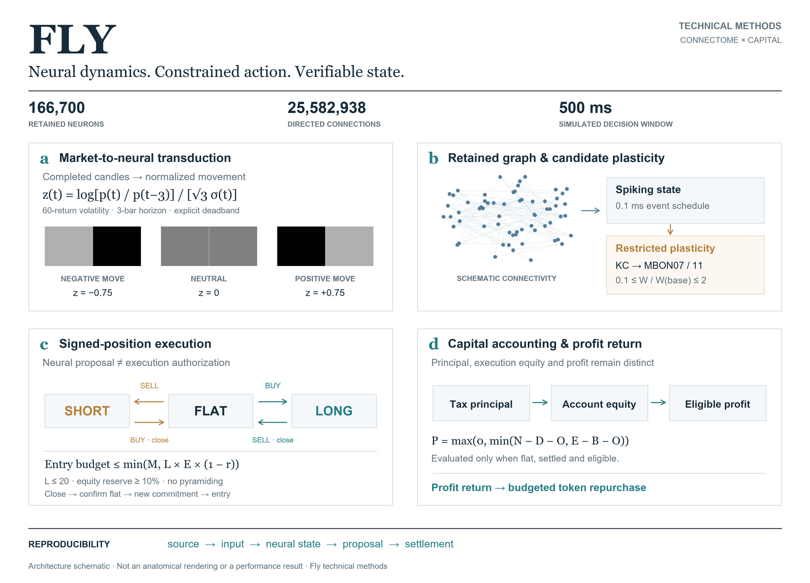

# FLY
### Connectome-driven control under verifiable capital constraints

**Spiking neural dynamics · Anatomically grounded connectivity · Auditable execution**

[Methods](docs/METHODS.md) · [Architecture figure](docs/figures/fly-architecture.svg) · [Implementation map](docs/METHODS.md#implementation-map) · [Provenance](docs/PROVENANCE.md)

*Figure 1. A separation of sensory computation, action admissibility and capital accounting. The network proposes an action; execution depends on independently checked account state. Connectivity is schematic, and no performance data are plotted. [Vector figure](docs/figures/fly-architecture.svg).*

## Abstract

Fly is an experimental control system coupling a retained *Drosophila* male central nervous system connectome to a contract-constrained trading account. Its controller operates on **166,700 neurons and 25,582,938 directed connections**, using the Stonkfly implementation of the MaleCNS graph. Completed market observations are transformed into visual stimuli, propagated through spiking neural dynamics, and decoded through identified descending-neuron populations. An engineered, dopamine-associated plasticity mechanism modifies selected existing connections in response to settled accounting changes.

The system separates **neural proposal**, **execution authorization**, and **economic settlement**. Position constraints, transaction continuity, capital-basis accounting and bounded profit return are implemented outside the neural network. Content-addressed inputs, state checkpoints and sequential commitments support reproducibility and retrospective verification. The research object is an inspectable controller–execution interface; neither profitable learning nor biological equivalence is established.

| Retained neural graph | Integration resolution | Decision window | Execution regime |
|:--|:--|:--|:--|
| 166,700 neurons · 25,582,938 edges | 0.1 ms model timestep | 500 ms simulated neural time | BTC perpetuals · long / flat / short · up to 20× entry setting |

Graph counts refer to the imported model, not the complete biological information contained in the underlying specimen. Neural time is distinct from wall-clock computation time.

## 1 · From market observations to neural action

Let $p_t$ denote a completed candle's close, $r_t=\log(p_t/p_{t-1})$, and $\sigma_t$ the population standard deviation of the latest 60 returns, floored at $10^{-6}$. The sensory encoder uses

$$
z_t=\frac{\log(p_t/p_{t-3})}{\sqrt{3}\,\sigma_t}.
$$

A neutral field is emitted for $|z_t|<0.05$. Otherwise, a bounded luminance proportional to $\min(|z_t|,1)$ is applied to the left or right half of a $320\times180$ RGB frame. This is an explicit, project-designed transducer. It introduces a directional market prior; it is not a claim that a biological circuit intrinsically represents price.

The retained graph evolves under the upstream spiking model. A fixed readout compares mean DNp20 firing rates, subject to a DNpe017 activity gate:

$$
\delta_t=\bar\nu_{R,t}-\bar\nu_{L,t},\qquad
\hat a_t=
\begin{cases}
\mathrm{BUY},&g_t>0\;\land\;\delta_t\ge2\,\mathrm{Hz},\\
\mathrm{SELL},&g_t>0\;\land\;\delta_t\le-2\,\mathrm{Hz},\\
\mathrm{HOLD},&\text{otherwise}.
\end{cases}
$$

The neural output selects a proposal, not a wallet recipient, leverage multiplier or transfer permission. [Sensory implementation](flyterm/sensory.py) · [Neural decoder](vendor/stonkfly/stonkfly/neural/controller.py).

## 2 · Plasticity with an explicit experimental hypothesis

Plasticity is restricted to reconstructed KC-to-MBON07/11 connections. PAM11- and PPL101-associated compartments provide engineered reinforcing signals. For a selected edge $e$, the implementation maintains filtered activity traces and two efficacy states:

$$
\dot u_e=-\frac{u_e}{\tau_u}
+\eta\left(k_e\,\widetilde d_e-d_e\,\widetilde k_e\right),
\qquad
\dot w_e=\frac{u_e-w_e}{\tau_w},
\qquad
W_e=W_e^{(0)}(1+w_e).
$$

Here $d_e$ is the anatomically weighted, baseline-centered dopaminergic activity for the edge's compartment. The implementation bounds $W_e/W_e^{(0)}$ to $[0.1,2.0]$, with $\tau_u=1800$ s and $\tau_w=0.05$ s in simulated time. This is an adaptation motivated by [Huang et al. (2024)](https://doi.org/10.1038/s41586-024-07819-w); applying it to this retained male graph is a model assumption, not a reproduction of that paper's biological validation.

Feedback is derived from changes in **settled trading net less booked operating cost**. Small changes fall inside a deadband. It is not an oracle for optimal actions or a precise causal attribution of profit to individual neurons. [Rule implementation](vendor/stonkfly/stonkfly/neural/rule.py) · [Feedback implementation](flyterm/live.py).

## 3 · The execution boundary

Version 0.5 uses a **long–flat–short** state space with a configurable entry-leverage ceiling up to **20×**. From flat, BUY can open a long and SELL can open a short. Against an existing opposite position, either action is reduce-only. Same-direction pyramiding is rejected; crossing zero requires a completed close followed by a new valid commitment.

For equity $E_t$, order ceiling $M$, leverage ceiling $L\le20$, reserve fraction $r\ge0.10$ and venue lot size $\Delta_q$,

$$
B_t^{\mathrm{entry}}=\min\left(M,L(1-r)E_t\right),\qquad
p_t^{\mathrm{size}}=\max\left(p_t^{\mathrm{oracle}},p_t^{\mathrm{limit}}\right),
$$

$$
\left|q_t^{\mathrm{entry}}\right|=\Delta_q
\left\lfloor\frac{B_t^{\mathrm{entry}}}{p_t^{\mathrm{size}}\Delta_q}\right\rfloor.
$$

The conservative sizing price prevents a lower short-sale limit from increasing reference-price exposure. A 20× venue setting with a 10% equity reserve allows at most approximately 18× initial gross exposure before the absolute order cap and lot rounding. The contract verifies the account's actual native leverage setting before entry.

The dedicated account uses cross margin. A short-enable control can disable new shorts while preserving buy-to-cover. Sequence, freshness, price tolerance, minimum notional, pending operations, pause state and order-rate limits remain enforced. Unexpected native-position changes trigger quarantine; liquidation and execution delays are not converted into fictitious fills. The stop threshold is a trigger, not a guaranteed loss ceiling.

[Signed-position account](contracts/src/v05/TradingAccountV05.sol) · [Native risk reader](contracts/src/v05/NativeCoreReadV05.sol) · [Position mathematics](contracts/src/v05/PositionMathV05.sol) · [Action and margin semantics](docs/METHODS.md#action-space).

## 4 · Principal is an accounting invariant

The intended funding path converts X Layer trading-tax proceeds toward native USDC, bridges through Circle CCTP, and allocates the received value as trading principal. Profit return is a separate accounting path.

Let $N_t$ be cumulative settled trading net, $D_t$ previously allocated profit, $O_t$ booked operating cost, $E_t$ current account equity and $B_t$ retained capital basis. When the account is flat, settled and otherwise eligible, the return ceiling is

$$
P_t^{\mathrm{eligible}}=
\max\left(0,\min\left(N_t-D_t-O_t,\ E_t-B_t-O_t\right)\right).
$$

It is zero when the eligibility conditions fail, including disagreement between recorded and native positions. A new deposit is principal; a favorable conversion is not automatically trading profit. The return path binds message identity, source, destination and accounting category. Buyback budgets are funded through the profit route and constrained by quote budgets and price checks. [Accounting specification](docs/METHODS.md#capital-accounting).

## 5 · Reproducibility and verification

Each observation binds the market input, neural output, preceding and succeeding state fingerprints, and a run identity. The local record chain uses

$$
H_t=\operatorname{SHA256}\!\left(
\operatorname{canonicalJSON}\{\mathrm{previous}:H_{t-1},\ \mathrm{body}:R_t\}
\right).
$$

Checkpoints and artifacts are addressed by content. Replay checks the declared source, model, policy and execution environment. Selected record and state roots can be committed through the on-chain registry.

These mechanisms establish different properties:

| Evidence | What it supports |
|:--|:--|
| Locked source and dataset fingerprints | Identity of the declared implementation and inputs |
| Same-environment replay | Reproduction of the recorded computation from retained state and inputs |
| Externally held or on-chain record roots | Detection of alteration relative to that published commitment |
| Venue records and account reconciliation | Evidence for actual execution and account transitions |

A signature is not a proof of neural computation. A local hash chain alone cannot reveal replacement of the entire history without an external reference. Publication completeness, market-data integrity and the settlement signer remain explicit trust boundaries. [Verification model](docs/METHODS.md#verification-model).

## Research scope

The v0.5 controller and execution source are published here with an unarmed [policy profile](config/policy-v05.json). Historical v03/v04 contracts remain in the tree for versioned compatibility. Existing deployed trial accounts do not gain short support through a documentation or configuration change. See [v0.5 implementation notes](docs/V05-LONG-SHORT.md).

This repository contains source and a technical methods description. It does not represent a peer-reviewed Fly paper, a biological validation study or a demonstrated trading edge. Production identity, deployment configuration and live performance evidence are separate release artifacts; no trial address is presented as an official instance here.

The next scientific question is empirical: does the adaptive controller improve out-of-sample behavior relative to frozen weights, shuffled feedback, cash and passive BTC exposure after execution costs? The [evaluation protocol](docs/METHODS.md#evaluation-protocol) distinguishes that question from software acceptance.

## Source and references

| Component | Entry point |
|:--|:--|
| Sensory transduction | [`flyterm/sensory.py`](flyterm/sensory.py) |
| Neural controller and memory | [`vendor/stonkfly/stonkfly/neural/`](vendor/stonkfly/stonkfly/neural/) |
| Run journal and replay | [`flyterm/records.py`](flyterm/records.py), [`flyterm/live.py`](flyterm/live.py) |
| Signed positions and 20× entry constraints | [`contracts/src/v05/`](contracts/src/v05/) |
| Capital routing and profit accounting | [`contracts/src/v03/`](contracts/src/v03/) |
| Immediate recovery variants | [`contracts/src/v04/`](contracts/src/v04/) |
| Operator planning and reconciliation | [`flyterm/ops/`](flyterm/ops/) |

1. **MaleCNS v1.0.** [Janelia project and dataset](https://male-cns.janelia.org/). Anatomical reconstruction and release provenance; CC BY dataset terms.
2. **Stonkfly.** [Upstream retained-connectome implementation](https://github.com/nftechie/stonkfly). Neural runtime and experimental memory mechanism; MIT.
3. **Huang, C., Luo, J., Woo, S. J., et al.** *Dopamine-mediated interactions between short- and long-term memory dynamics.* Nature **634**, 1141–1149 (2024). [doi:10.1038/s41586-024-07819-w](https://doi.org/10.1038/s41586-024-07819-w).

Fly is an independent project. Dataset, protocol and institution names identify sources and dependencies, not affiliations or endorsements. Project source is MIT; upstream and dataset terms are preserved in [Provenance](docs/PROVENANCE.md) and [Disclosure](DISCLOSURE.md).
