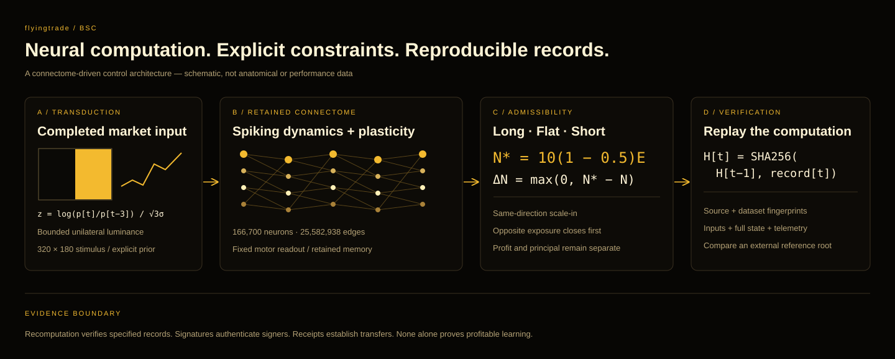

<div align="center">


# flyingtrade · BSC
### Connectome-driven control with reproducible neural dynamics

**Spiking networks · Anatomically grounded connectivity · Explicit capital invariants**

[Methods](docs/METHODS.md) · [Independent replay](docs/REPRODUCIBILITY.md) · [Control contracts](contracts/src/bsc/) · [Provenance](docs/PROVENANCE.md)

</div>



*Figure 1. Computation, action admissibility and evidence are separate layers. The connectivity illustration is schematic; it is not an anatomical reconstruction or a performance plot.*

## Abstract

flyingtrade studies a control interface between a retained *Drosophila* male central nervous system connectome and an explicitly constrained financial state machine. The model contains **166,700 neurons and 25,582,938 directed connections**. Completed market observations become visual stimuli; spiking dynamics propagate through the retained graph; fixed descending-neuron readouts propose an action. An engineered plasticity rule modifies selected existing connections in response to changes in settled accounting.

The BSC architecture separates **neural computation**, **long–flat–short admissibility**, **capital accounting**, and **record verification**. BNB-denominated creator-tax receipts are the conceptual capital source; Hyperliquid is the execution venue. Neither market meaning, profitable learning nor biological equivalence follows merely from using a connectome.

| Model scale | Numerical resolution | Observation window | Control policy |
|:--|:--|:--|:--|
| 166,700 neurons / 25,582,938 edges | 0.1 ms timestep | 500 ms neural time | Long / flat / short; native 10×; 50% sizing reserve |

Neural time is distinct from wall-clock runtime. The reserve constrains target exposure; it does not guarantee protection against liquidation.

## 1 · Sensory transduction

Let $p_t$ be the close of a completed candle and $\sigma_t$ the population standard deviation of the latest 60 log returns, floored at $10^{-6}$. The movement encoder computes

```math
z_t=\frac{\log(p_t/p_{t-3})}{\sqrt{3}\,\sigma_t}.
```

For $|z_t|<0.05$, the input is neutral. Otherwise, bounded luminance proportional to $\min(|z_t|,1)$ is applied to one half of a $320\times180$ RGB frame. This transducer is engineered: the graph is not assumed to possess an intrinsic representation of asset prices. See [sensory.py](flyterm/sensory.py).

## 2 · Fixed neural readout and plastic memory

Let $\bar{\nu}_R$ and $\bar{\nu}_L$ denote mean DNp20 firing rates and $g_t$ the DNpe017 gate. The readout is

```math
\delta_t=\bar{\nu}_{R,t}-\bar{\nu}_{L,t},\qquad
\widehat{a}_t=\begin{cases}
\mathrm{BUY},&g_t>0\land\delta_t\ge2\,\mathrm{Hz},\\
\mathrm{SELL},&g_t>0\land\delta_t\le-2\,\mathrm{Hz},\\
\mathrm{HOLD},&\text{otherwise}.
\end{cases}
```

Plasticity acts on selected reconstructed KC-to-MBON07/11 edges, rather than inventing new anatomical connections. For a selected edge, the implementation evolves an intermediate state $u_e$ and efficacy state $w_e$:

```math
\dot{u}_e=-u_e/\tau_u+\eta\left(k_e\widetilde{d}_e-d_e\widetilde{k}_e\right),\quad
\dot{w}_e=(u_e-w_e)/\tau_w,\quad W_e=W_e^{(0)}(1+w_e).
```

The multiplicative efficacy range is $[0.1,2.0]$, with $\tau_u=1800$ s and $\tau_w=0.05$ s in simulated time. Compartment-associated dopamine and filtered activity traces define the update. This is an experimental model assumption, not evidence that biological reward circuits optimize financial returns. [Controller](vendor/stonkfly/stonkfly/neural/controller.py) · [Plasticity rule](vendor/stonkfly/stonkfly/neural/rule.py).

## 3 · Capital-relative action admissibility

The network proposes direction; it cannot choose a recipient, a leverage multiplier or withdrawal authority. With equity $E_t$, native leverage $L=10$ and reserve fraction $r=0.5$,

```math
N_t^*=L(1-r)\max(E_t,0)=5\max(E_t,0),\qquad
\Delta N_t=\max(0,N_t^*-N_t^{\mathrm{existing}}).
```

A same-direction proposal may add only the remaining gap to this target. Size is rounded down to the venue lot step using the more conservative of the oracle and limit prices. There is **no fixed monetary order ceiling**. An opposite-direction proposal reduces existing exposure first; crossing through zero requires completed settlement and a new admissible commitment.

A position-level stop is triggered when directional unrealized loss $\ell_t$ reaches 40% of the leverage-implied initial margin:

```math
\ell_t\ge0.40\,N_{\mathrm{entry}}/10.
```

This is a trigger, not a guaranteed maximum loss. [Exact fixed-point sizing](contracts/src/v05/PositionMathV05.sol) · [BSC-route account](contracts/src/bsc/TradingAccountBsc.sol).

## 4 · Principal, profit and transport

The BSC route is

```math
\text{BNB tax receipt}\rightarrow\text{bridge settlement}\rightarrow\text{received USDC principal}\rightarrow\text{constrained account}.
```

Principal is credited only against an actual USDC transfer. Profit and principal recovery use segregated exits. For settled trading net $N_t$, previously allocated profit $D_t$, booked operating cost $O_t$, current equity $E_t$ and retained basis $B_t$,

```math
P_t=\max\left(0,\min(N_t-D_t-O_t,\ E_t-B_t-O_t)\right),
```

subject to a flat, settled, position-consistent account. Ineligible states yield zero. Returned profit may fund BNB buybacks; curve purchases remain in escrow until graduation, after which burn delivery is measured by actual token balances.

The bridge boundary is **operator-mediated**. The creator wallet temporarily holds funds, and Relay is an external execution dependency. Source and destination receipts make the path inspectable; they do not remove custody risk or constitute a cryptographic proof of cross-chain provenance. [Principal ingress](contracts/src/bsc/PrincipalDepositBsc.sol) · [Segregated return](contracts/src/bsc/ReturnOutboxBsc.sol) · [BNB buyback](contracts/src/bsc/NativeProfitBuybackBsc.sol).

## 5 · Recompute, rather than infer from an animation

Each observation binds its input, neural output, preceding and succeeding state fingerprints, sampled telemetry and run identity. With canonical JSON encoding,

```math
H_t=\mathrm{SHA256}\left(\mathrm{canonicalJSON}\{\mathrm{previous}:H_{t-1},\mathrm{body}:R_t\}\right).
```

The independent verifier checks an externally referenced record root **before importing archived source**. It then checks source and artifact hashes, model identity, sensory reconstruction, feedback, every neural output, the complete state fingerprint and sampled time bins.

```bash
python scripts/replay_recording.py \
  --bundle ./recording \
  --expected-root <independently-obtained-record-root>
```

Obtain the recording bundle and its reference root separately. Install the bundle's pinned requirements, obtain the checksum-locked MaleCNS dataset, and use the declared compatible environment. Detailed steps and evidence limits are in [Independent replay](docs/REPRODUCIBILITY.md).

| Evidence | Supported claim | Not established |
|:--|:--|:--|
| Source and dataset fingerprints | Declared implementation/input identity | Completeness or scientific validity |
| Matching recomputation | Reproduced computation for specified rounds | A trading edge |
| External/on-chain record root | Consistency with that published commitment | Correct computation by itself |
| Confirmed receipts and venue reconciliation | Specified financial transitions occurred | Future execution or returns |

## Research release scope

This repository contains technical methods, neural source, BSC-route control contracts and a read-only recording verifier. It contains no operational wallet configuration, deployed project addresses, transaction history, private credentials or server instructions. The source snapshot is a research release; each recording carries the exact archived runtime required for that recording's replay.

flyingtrade is not presented as a peer-reviewed paper, a biological validation study or a demonstrated profitable strategy. An empirical evaluation must compare adaptive versus frozen weights, shuffled feedback, cash and passive exposure on held-out observations, including execution costs. See [Methods and evaluation](docs/METHODS.md) and [Disclosure](DISCLOSURE.md).
